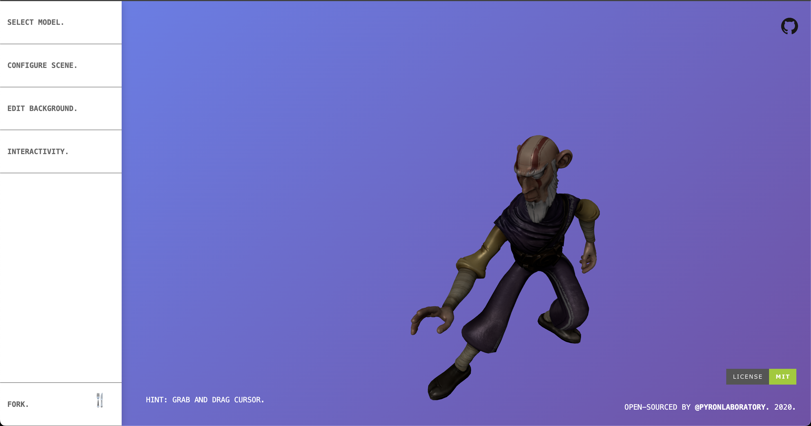

# photon-editor


This is the official playground and demonstration repository for [**photon-editor**](https://www.npmjs.com/package/photon-editor). It provides a full-featured graphical user interface to interactively explore the library's capabilities.



## Overview

The Playground serves as a reference implementation for integrating `photon-editor` into a modern web application. It demonstrates:

- **Reactive UI-to-Engine Binding**: Connecting standard HTML5 input elements to the `PhotonEditor` API.
- **Dynamic Asset Loader**: Visual interface for hot-swapping GLB/GLTF models and triggering animations.
- **Interactive Scene Control**: Real-time manipulation of environment lighting, camera matrices (FOV, clipping planes) and spatial orientation.
- **Micro-Interaction Toggle**: Demonstration of the library's bone-tracking interactivity.
- **Environment Studio**: Tools for adjusting background gradients, colors, and canvas transparency.

### Tech Stack

- **Core Engine**: `photon-editor` (via npm)
- **Rendering**: `three.js`
- **Build Tooling**: `Vite 8` for optimized HMR and production bundling.
- **Language**: Standard ES6+ JavaScript.

---

## Implementation

The playground interacts with the library by instantiating the `PhotonEditor` class and exposing its methods to the UI layer:

### Example: Binding UI Inputs

```javascript
import { PhotonEditor } from "photon-editor";

const editor = new PhotonEditor();
editor.render();

// Mapping a range input to the Camera FOV
const fovSlider = document.querySelector("input[name='fov-input']");
fovSlider.addEventListener("input", (event) => {
  editor.perspective({
    field: "fov-input",
    offset: event.target.value,
  });
});
```

---

## Getting Started

### Local Development

1. **Clone & Install**:

   ```bash
   npm install
   ```

2. **Run Development Server**:

   ```bash
   npm run dev
   ```

3. **Production Build**:
   ```bash
   npm run build
   ```

## Support & Funding

If you find this project or its underlying library useful, please consider supporting its development and leaving a star if you appreciate the work.

<a href='https://ko-fi.com/F1F1VEXA' target='_blank'></a>
